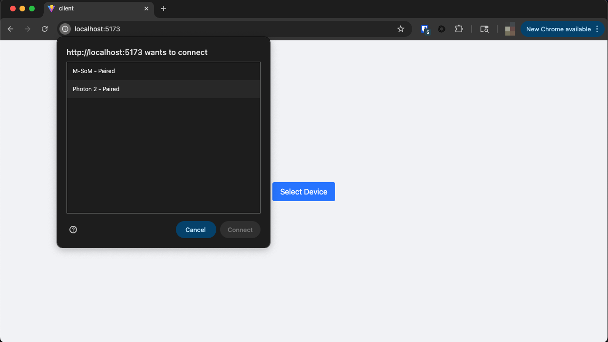
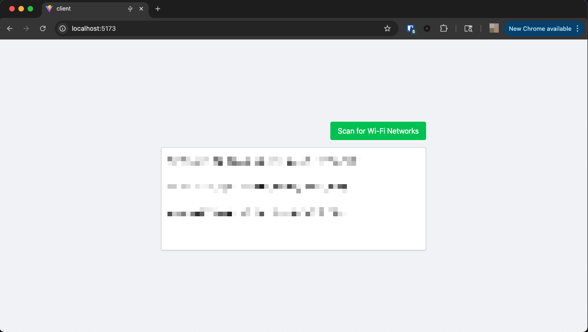
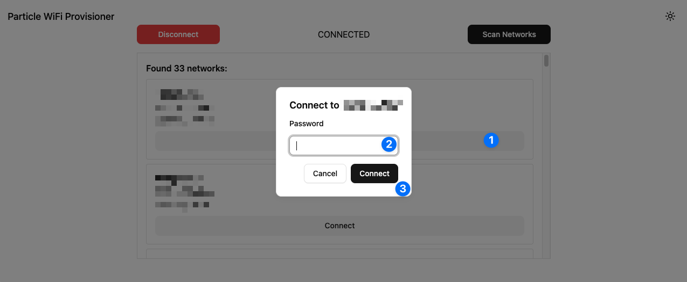

# Blueprint Advanced Protected Device WiFi Provisioning

**Difficulty:** Advanced

**Estimated Time:** 1 hour

**Hardware Needed:** None

---

### Overview

This blueprint provides an example [React](https://react.dev/) application that uses [WebUSB](https://developer.mozilla.org/en-US/docs/Web/API/WebUSB_API) to provision WiFi credentials for [Particle devices that are "protected"](https://docs.particle.io/scaling/enterprise-features/device-protection/). This project is broken up into two parts: `client`, and `server`. The React client interacts with the device directly, while the [Express](http://expressjs.com/) `server` authenticates with the Particle service via a `PARTICLE_ACCESS_TOKEN` and serves an endpoint on `localhost:3000`.

---

### Tools & Materials

- Particle WiFi device (Photon 2, Muon, Argon)
- USB cable
- Chrome web browser
- [NodeJS installation](https://nodejs.org/en/download)
- [Particle CLI](https://docs.particle.io/getting-started/developer-tools/cli/)

---

### Steps

1. **Clone this repository:**

   ```bash
   git clone https://github.com/particle-iot/blueprint-advanced-wifi-provisioning.git
   cd blueprint-advanced-wifi-provisioning
   ```

2. **Start the React client**
   In a terminal instance run the following commands:

   ```bash
   cd client
   npm install
   npm run dev
   ```

3. **Generate an access token** for the web server:

   1. In another terminal instance, run the following command to generate a new access token:

   ```bash
   particle token create
   ```

   2. Create a `.env` file in `blueprint-advanced-wifi-provisioning/server` and populate it with the following:

   ```txt
   PARTICLE_ACCESS_TOKEN="your_access_token"
   ```

4. **Start the web server**
   In a new terminal instance, while the client is still running, execute the following commands:

   ```bash
   cd server
   npm install
   npm run dev
   ```

5. **Test the provisioning flow**

   1. With a WiFi enabled protected Particle device plugged in, navigate to `localhost:5173` in your Chrome browser (Web USB may not be support on other browsers). Then, choose "Select Device" and select your target device:
      

   2. Once paired, click "Scan for Wi-Fi Networks". At this step, your client will communicate with the server to unprotect your device using the access token you just generated.
      

   3. Select the network SSID you'd like to connect your device to and you'll be prompted to enter the WiFi password:
      

6. **Validate the credentials**
   You can test that the credentials were properly stored by running: `particle wifi list` in a terminal.

---

### How It Works

The main UI lives in `client/src/App.jsx` and is responsible for interacting with the Particle device over WebUSB.

You'll notice that `ParticleUSB` is declared as a global variable. The `ParticleUSB` module bundle is generated from the [project's source](https://github.com/particle-iot/particle-usb) and stored in `client/public/particle-usb.bundle.js`. It is linked to the web app in `client/index.html`:

```html
<script src="/particle-usb.bundle.js"></script>
```

If you need to re-generate a new bundle for your application, you can download the [particle-usb repository](https://github.com/particle-iot/particle-usb) and run:

```bash
git submodule update --init
npm run install
npm run build
```

The `particle-usb.bundle.js` file will be stored in the `dist` folder and can be copied into this project's `public` directory.

In `App.jsx`, the first step before interacting with the `ParticleUsb` device, is to "unprotect" the device via the `unprotectDevice` function. This makes a web request to the server instance at the `http://localhost:3000/unprotect/:deviceId` endpoint. This handshake mechanism ensures you are authorized to interact with this device over USB. It would be a good idea to protect this web app behind an authorization flow.

Once the device is unprotected, you can run the traditional WiFi operations on the device such as `scanWifiNetworks` and `joinNewWifiNetwork`. These operations happen synchronously in `handleStartScan` and `handleSelectSsid`.

There are some operations gated behind React states, for example, if a `selectedDevice` doesn't exist, the `Select Device` button component gets rendered:

```jsx
{
  !selectedDevice && (
    <button
      onClick={handleGetDevices}
      disabled={isLoading}
      className="px-4 py-2 bg-blue-500 text-white rounded hover:bg-blue-600"
    >
      Select Device
    </button>
  );
}
```

Once a device is selected, but an SSID hasn't been chosen, the results from the scan are displayed in a list:

```jsx
{
  selectedDevice && !selectedSsid && (
    <div className="flex flex-col items-end space-y-4">
      <button
        onClick={handleStartScan}
        disabled={isScanning}
        className="px-4 py-2 bg-green-500 text-white rounded hover:bg-green-600 hover:cursor-pointer"
      >
        {isScanning ? "Scanning..." : "Scan for Wi-Fi Networks"}
      </button>
      <div className="h-56 w-xl overflow-y-auto bg-white border border-gray-300 rounded shadow">
        {filteredSsids.map((ssid, index) => (
          <div
            key={index}
            className="hover:bg-gray-100 hover:cursor-pointer w-full p-4"
            onClick={() => handleSelectSsid(ssid)}
          >
            {ssid.ssid} (Signal: {ssid.rssi} dBm, Security: {ssid.security})
          </div>
        ))}
      </div>
    </div>
  );
}
```

Finally, if a device is selected and an SSID is selected, the password prompt is rendered:

```jsx
{
  selectedDevice && !selectedSsid && (
    <div className="flex flex-col items-end space-y-4">
      <button
        onClick={handleStartScan}
        disabled={isScanning}
        className="px-4 py-2 bg-green-500 text-white rounded hover:bg-green-600 hover:cursor-pointer"
      >
        {isScanning ? "Scanning..." : "Scan for Wi-Fi Networks"}
      </button>
      <div className="h-56 w-xl overflow-y-auto bg-white border border-gray-300 rounded shadow">
        {filteredSsids.map((ssid, index) => (
          <div
            key={index}
            className="hover:bg-gray-100 hover:cursor-pointer w-full p-4"
            onClick={() => handleSelectSsid(ssid)}
          >
            {ssid.ssid} (Signal: {ssid.rssi} dBm, Security: {ssid.security})
          </div>
        ))}
      </div>
    </div>
  );
}
```

Connecting prompts the device to `joinNewWifiNetwork` and `resets` the device protection state via:

```js
await selectedDevice.unprotectDevice({ action: "reset" });
```

---

### Topics Covered

- [Particle CLI](https://docs.particle.io/getting-started/developer-tools/cli/)
- [WiFi setup options](https://docs.particle.io/reference/device-os/wifi-setup-options/)
- [Device protection](https://docs.particle.io/scaling/enterprise-features/device-protection/)

---

### Extensions

The next step would be to add authentication to this web application so that only authorized users can interact with your Particle devices.
