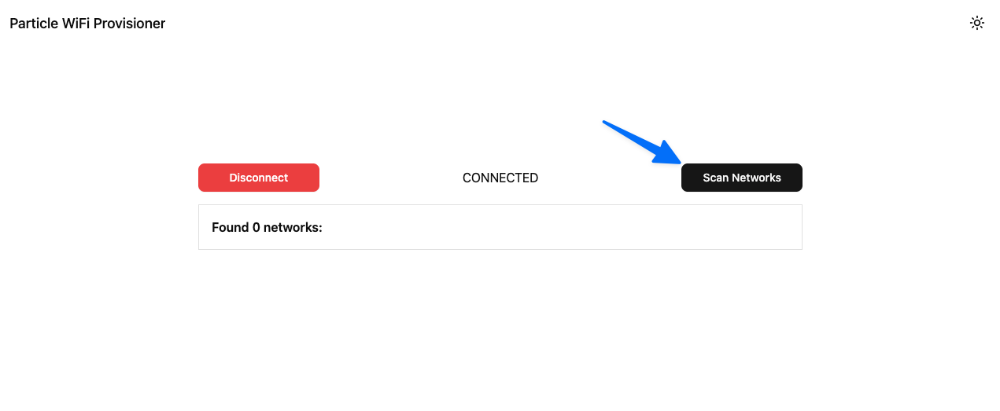
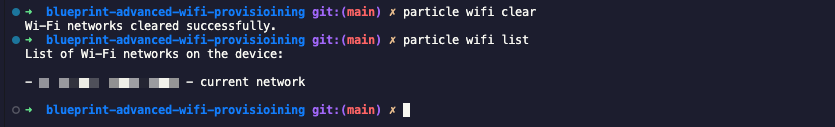

# Blueprint Advanced Protected Device WiFi Provisioning

**Difficulty:** Advanced

**Estimated Time:** 1 hour

**Hardware Needed:** WiFi Particle devices

---

### Overview

This blueprint provides an example [React](https://react.dev/) application that uses [WebBLE](https://developer.mozilla.org/en-US/docs/Web/API/Web_Bluetooth_API) to provision network credentials for WiFi enabled Particle devices. This project is broken up into two parts: `client`, and `src/main.cpp`. The React client interacts with the device directly over WebBLE and is intended to be easily ported to [React Native (mobile) by making use of Expo](https://docs.expo.dev/tutorial/create-your-first-app/).

---

### Tools & Materials

- Particle WiFi device (Photon 2, Muon, Argon)
- Chrome web browser
- [NodeJS installation](https://nodejs.org/en/download)
- [Particle CLI](https://docs.particle.io/getting-started/developer-tools/cli/)

---

### Steps

1. **Clone this repository:**

   ```bash
   git clone https://github.com/particle-iot/blueprint-advanced-wifi-provisioning.git
   cd blueprint-advanced-wifi-provisioning
   ```

2. **Start the React client**
   In a terminal instance run the following commands:

   ```bash
   cd client
   npm install
   npm run web
   ```

3. **Open in a Chrome browser**
   Navigate to [localhost:8081](http://localhost:8081)

---

### Usage

1. **Test the provisioning flow**

   1. With a nearby WiFi capable Particle device powered on, navigate to `localhost:8081` in your Chrome browser (Web BLE may not be support on other browsers). Then, choose "Connect" and select your target device:
      

   2. Once paired, click "Scan Networks". At this step, a command will be sent to the device to perform a Wi-Fi scan. Once successful, the list of nearby networks will be displayed in the UI.
      

   3. Select the network SSID you'd like to connect your device to and you'll be prompted to enter the WiFi password. Once the password is sent to the device, wait a few seconds for the device to retry connection to the network.
      

2. **Validate the credentials**
   You can test that the credentials were properly stored by running: `particle wifi list` in a terminal.
   

---

### How It Works

The main UI lives in `client/app/provisioner.jsx` and is responsible for interacting with the Particle device over WebBLE.

You'll notice that it makes use of a `serviceUUID`, `rxCharacteristicUUID`, `txCharacteristicUUID`, `versionCharacteristicUUID`, and a `mobileSecret`. These values are defined in the firmware (`src/main.cpp`) and can be customized. It's best to customize them so that your provisioning tool only works with your hardware.

In `client/lib/particleUtils.ts` you'll find most of the BLE logic. It makes heavy use of the [@particle/ecjpake](https://www.npmjs.com/package/@particle/ecjpake) and [@particle/device-os-protobuf](https://www.npmjs.com/package/@particle/device-os-protobuf) libraries in order to properly communicate with Device OS.

All of the actual BLE interaction happens in a global context provider in `client/hooks/useBluetooth.tsx`. You might start here if you are interested in porting to a mobile environment by swapping WebBLE to a mobile friendly BLE library.

The `client/components/bleButtons.tsx` component conditionally renders the BLE interaction buttons based on the connection state.

The `client/components/scanResults.tsx` component renders the list of available SSIDs.

---

### Topics Covered

- [Particle CLI](https://docs.particle.io/getting-started/developer-tools/cli/)
- [WiFi setup options](https://docs.particle.io/reference/device-os/wifi-setup-options/)

---

### Extensions

You can deploy this application so that your users can directly provision their own devices.
